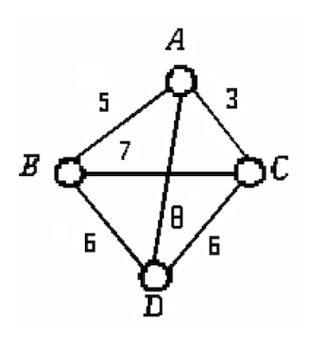
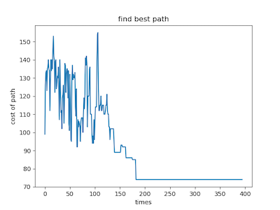

# 典型的运筹规划问题——旅行商问题（TSP）

## TSP问题
有4个集市A，B，C，D，它们之间的距离如图所示：

	

设有一个货郎挑着担子从集市A出发。他想依次走遍每 个集市，但不走任何一段重复路线回到A，而且要求所走过的路程总长度最短。那么他究竟应该怎样走法呢？

## 运行环境
- python2.7
- 为了方便，算法随机生成是9个城市的邻接矩阵作为输入

## 运行
- python SA.py

## 运行结果

	

